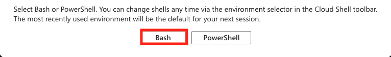
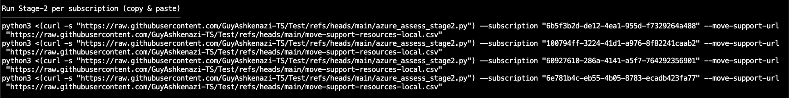
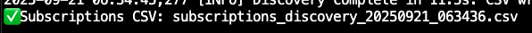
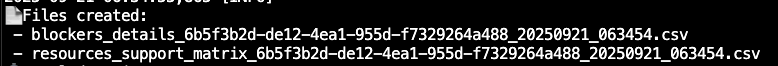
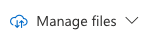
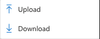
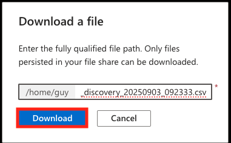
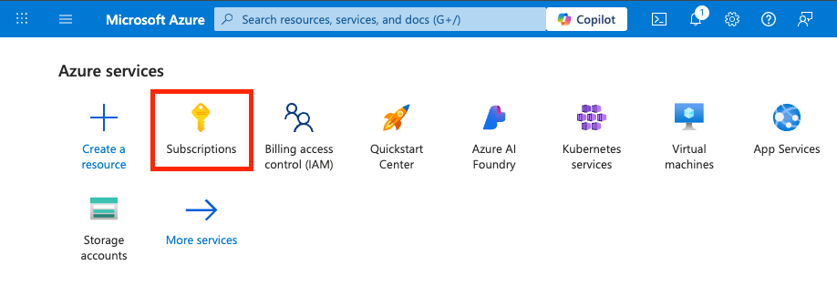
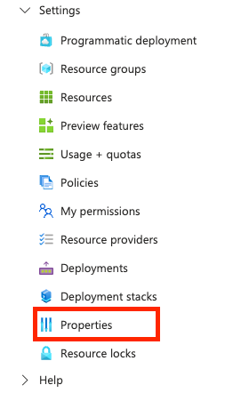
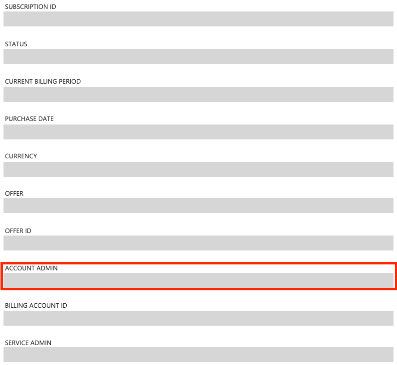

# Azure Environment Assessment

## 🎯 Purpose
This project provides a **safe, read-only assessment** of your Azure environment.  
It runs in **two lightweight stages** so you can quickly understand:

- Which **subscriptions** exist in your tenant
- Each subscription’s **type** (MSDN, Pay-As-You-Go, EA, MCA, CSP)
- Who the **owner** is (Account Admin, Billing Owner, or Partner-managed)
- Whether the subscription is **transferable** to an EA
- Which **resources** are supported / not supported for move between subscriptions

> ✅ Both Stage-1 and Stage-2 are **read-only**.  
> They do not create, modify, or delete anything.

---

## ✅ Prerequisites

To run the scripts successfully, make sure your user has:

- **Reader** role on the subscriptions you want to scan  
- **Billing Reader** role on the relevant Billing Account / Profile (for MCA ownership)  
- (Optional) Classic access improves Account Admin detection on **MSDN / PAYG / legacy EA**

---

## 🚀 How to Run

### Step 1 – Open the correct Azure Directory
1. Go to the [Azure Portal](https://portal.azure.com).  
2. On the top-right, click **Directory + Subscription** and switch to the correct tenant.

### Step 2 – Launch Cloud Shell (Bash)
- Click the **Cloud Shell** icon in the top bar.  
- Select **Bash**.  
  

### Step 3 – Run Stage-1 (Subscription Discovery)

Copy and paste:

```bash
python3 <(curl -s https://raw.githubusercontent.com/GuyAshkenazi-TS/Test/refs/heads/main/azure_assess_stage1.py)
   ```
## What Stage-1 does
- Scans all subscriptions in the tenant  
- Produces a single CSV with high-level info  
- Prints ready-to-copy Stage-2 commands for each subscription  

---

## Step 4 – Run Stage-2 (Per Subscription Resource Scan)
For each subscription, Stage-1 will print a command like:



Run these one by one, or in **parallel terminals** for large subscriptions.  

---

## 📂 Output Files

### Stage-1
- `subscriptions_discovery_<timestamp>.csv` – High-level list of all subscriptions  


### Stage-2 (per subscription)
- `resources_support_matrix_<SUB>_<timestamp>.csv` – All resources in the subscription with **Yes / No / Not in table** support status  
- `blockers_details_<SUB>_<timestamp>.csv` – Only the unsupported / not-in-table resources (blockers)  


> The script will generate these files directly in your Cloud Shell home directory.

---

## 📥 How to Download the Files
Download via Cloud Shell GUI:

1. In the Cloud Shell window, click the **Download/Upload** icon (📂⬇️).  
2. Select **Download** and choose your CSV file.  

  
  
  

---

## 📤 How to Send Back the Files
- Download the CSV file to your local machine (see above).  
- Send them back via email, Teams, or any other secure channel you prefer.  

---

## 🧭 When the CSV Says “Check in Portal” – What to Do
Sometimes the **Account Admin** isn’t retrievable via API (common with **MSDN**, **Pay-As-You-Go**, or legacy **EA**).  
If the **Sub. Owner** column shows:  

- *“Check in Portal – classic subscription”*  
- *“Check in EA portal – Account Owner”*  

👉 If you see one of these in the **CSV output**, follow the steps below to get the information manually.

---

## Step-by-Step Instructions
1. Sign in to the [Azure Portal](https://portal.azure.com).  
2. In the left-hand menu, go to **Subscriptions**.  
3. Select the **subscription** you want to check.  
     
4. In the subscription’s menu, go to **Settings → Properties**.  
   - In some UI versions, you may just see **Properties** directly in the menu.  
     
5. In the **Properties** blade, look for the field **Account admin**.  
     
6. Copy the email address shown there — this is the **Account Admin (Owner)** of the subscription.  

---

## 🔍 How the Script Decides **Sub. Type**
The classification is primarily based on **quotaId** (from ARM):

- `MSDN_*` → **MSDN**  
- `PayAsYouGo_2014-09-01` / `MS-AZR-0003P` / `MS-AZR-0017P` / `MS-AZR-0023P` → **Pay-As-You-Go**  
- `MS-AZR-0145P` / `MS-AZR-0148P` / `MS-AZR-0033P` / `MS-AZR-0034P` → **EA**  

Additional rules:
- If `authorizationSource == ByPartner` → **CSP**  
- If ARM access is **forbidden** but **billing linkage exists** → **MCA-online**  

---

## 📌 MCA / CSP Notes
- **MCA**: Ownership is under *Cost Management* + *Billing* → *Role assignments*. 
  - Script shows the Billing Owner if you have permission. Otherwise: Check in Billing (MCA).   

- **CSP**: These subscriptions are **partner-managed**.  
  - You’ll see: *“Managed by partner – CSP”*.  

---

## 🔧 Troubleshooting
- **“Not available” / missing values**  
  - This usually means you don’t have access to ARM or Billing scopes.  
  - Ask for:  
    - **Reader** role (subscriptions)  
    - **Billing Reader** role (billing account / profile / invoice section)  

---

# ⚡ Quick Start (advanced users)

If you are already in the correct tenant and Cloud Shell (Bash):
```bash
python3 <(curl -s https://raw.githubusercontent.com/GuyAshkenazi-TS/Test/refs/heads/main/azure_assess_stage1.py)
   ```
